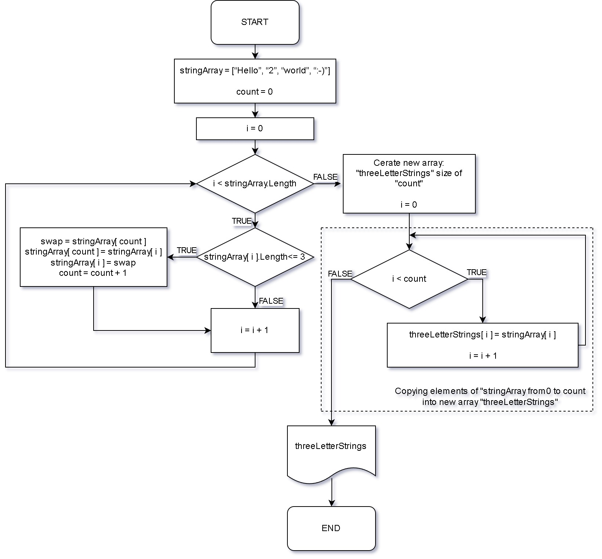

  #              MainBlockTest_1st_quarter



> The block diagram of the algorithm

# Description of the algorithm

## 1. Declare initial variables and create (or input) the array of strings

Declare the counter variable "**count**" and initialize it with the value of "**0**".
As an example the following array is used for the task ```[“Hello”, “2”, “world”, “:-)”]```.

## 2. Move to the left all the strings in the array with a size equal to or less than 3 letters

1. Declare index variable "**i**" and initialize it with the value of "**0**";
2. Loop through the "***stringArray***" array and move all 3 or fewer letter elements to the left;
   - if "*i*" is less than the length of the array then keep checking the elements of the array;
   - swap the values between "*stringArray[ i ]*" and "*stringArray[ count ]*" and increment the value of the counter "*count*" if the size of "*stringArray[ i ]*" is less then 4;
   - increment the value of index "*i*";
   - if "*i*" is equal to the length of the array proceed to the next step **3**, else return to point ***2*** step **2**

## 3. Create a new array "**threeLetterStrings**" with size equal to the counter "**count**"

## 4. Copy first "*count*" elements of "**stringArray**" into the new array "**threeLetterStrings**"
   - if "*i*" is less than the value of the counter "*count*" then keep copying the elements of the arrays;
   - copy the value of "*stringArray[ i ]*" to "*threeLetterStrings[ i ]*" and increment the value of the index "*i*";
   - increment the value of index "*i*";
   - if "*i*" is equal to the value of the counter "*count*" proceed to step **5**, else go back to step **4**;

## 5. Print the content of the array "**threeLetterStrings**"

For that purpose, we can use the short block diagram for output data.
Whereas, for example, in C# language we can use the method "Console.WriteLine" as given below:
```Bash
          Console.WriteLine("[{0}]", string.Join(", ", threeLetterStrings));
```
